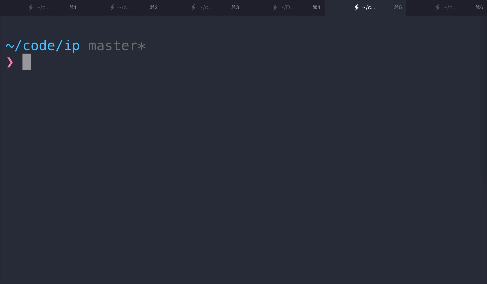

<h1 align="center">cliip</h1>

Get your ip info with a single cli command 💻

## What is cliip?
Cliip (shorthand for cli-ip) is the fastest way to know your public ip address directly from the command line interface.

Cliip uses the [ipinfo](http://ipinfo.io/) api to get the ip information.

## Requirements
* Node version >=6

## Install
`npm install --global cliip`

## Usage
Just type `ip` in your terminal and voila! 🎊

## Demo

## Commands
Some commands include:

* `ip country` - get current ip country
* `ip city` - get current ip city
* `ip hostname` - get current ip hostname

You can also chain arguments! 😄

`ip country city hostname`

Type `ip --help` to see all the available commands.

## License
MIT © [Enrique Benitez](https://bntz.io)
